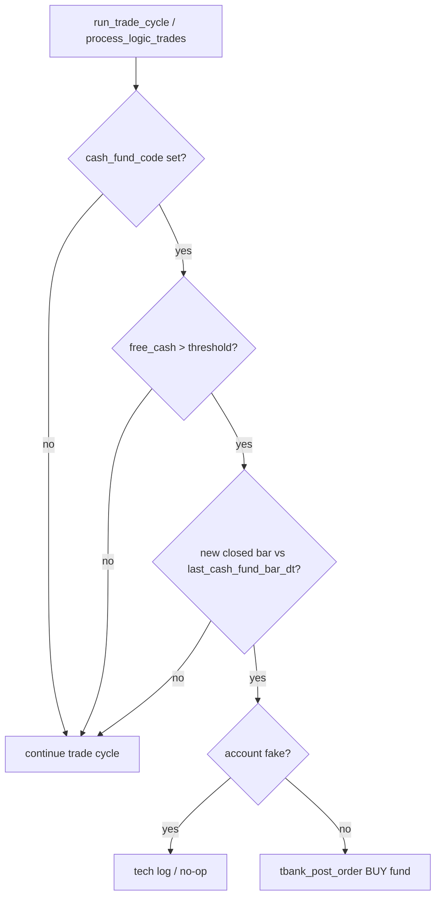

# Plan: Cash-fund runner buy + scheduled disk cleanup

**Status:** implemented (2026-07-18) — params/UI were in `1ddfa63`; runner park + schedule in follow-up commit  
**Date:** 2026-07-18  
**Scope:** execute what was explicitly out of scope in the cash-fund / general-settings pass.

## Background (already done)

| Piece | Where |
|-------|--------|
| `cash_fund_code` (`''` \| TMON \| LQDT \| SBMM), `cash_fund_threshold` (default **1000000**) | `01`, `logic-params.js`, logics UI |
| Manual cleanup + preference `APP_CLEANUP_DISK` | `cleanup_trading_disk_space()`, `GET/PUT /api/settings/cleanup`, `POST /api/maintenance/cleanup`, gear panel |
| T-Bank order primitive | `tbank_post_order(account_id, figi, qty, price, direction)` in `02` |

## Goals

1. **Trade runner:** when a logic has a non-empty `cash_fund_code` and free cash above `cash_fund_threshold`, park the excess in that money-market fund (real account → T-Bank order; fake → simulated bookkeeping only if we decide to track fund units).
2. **Scheduled cleanup:** when `APP_CLEANUP_DISK` is ON, run `cleanup_trading_disk_space()` on a schedule (pg_cron where available; Node fallback on Windows).

## Decisions (proposed defaults)

- **Free cash** = logic `current_balance` minus reserved margin for open live positions (same notion runner already uses for lot sizing). If that helper is ambiguous, use `current_balance` only for v1 and document it.
- **Park amount** = `max(0, free_cash - cash_fund_threshold)` (leave threshold as cash buffer).
- **Buy size:** convert park amount to lots via fund lot size / last price; skip if qty &lt; 1 lot.
- **Idempotency:** at most one park attempt per logic per closed bar of the logic `timeframe` (store `last_cash_fund_bar_dt` in `logic_params`, same pattern as `last_trade_bar_dt`).
- **Fake accounts:** do **not** call T-Bank; optionally log `app_tech_log` / skip silently (prefer skip + tech log when logging on).
- **Real accounts:** resolve FIGI for TMON/LQDT/SBMM (seed `security_prefixes.tbank_figi` or resolve via T-Bank instrument API); `tbank_post_order` BUY; record outcome in tech log (and optionally a synthetic `logic_trades` note later — not required for v1).
- **Cleanup schedule:** daily (e.g. 03:30 local) only if `cleanup_unused_market_data_enabled()`; Windows Node: same check on interval (e.g. once per day via timestamp in `parameter_values`).



## 1. Cash-fund park in runner

**Files (expected):**

- `sql/logic_trade_runner.sql` (synced into `02`) — new helper + call site after positions/signals or at end of `process_logic_trades` for enabled logics.
- `01` — seed `logic_param_defs.last_cash_fund_bar_dt` (text, service); ensure securities/prefixes for TMON, LQDT, SBMM exist with FIGI/lot if missing.
- `api/lib/logic-params.js` — read-only surface for the new service param if needed (may stay internal-only).
- Optional UI hint under cash-fund fields: «исполняется runner’ом на реальном счёте».

**SQL sketch:**

```sql
-- logic_park_excess_cash(p_logic_id INTEGER) RETURNS JSONB
-- reads cash_fund_code / cash_fund_threshold / current_balance / timeframe
-- if park_amount > 0 and new closed bar: place BUY or skip for fake
-- upsert last_cash_fund_bar_dt
```

**Wire:** call from `process_logic_trades` (or once per cycle for each enabled logic after main trade loop) so it shares UI-heartbeat / lock rules with the existing runner.

**Open points to resolve while coding:**

- Exact free-cash formula vs open lots.
- Market vs limit for funds (today `tbank_post_order` is LIMIT — may need market order type or last price ± slip).
- Whether selling fund units when cash is short is in scope (propose: **buy-only** this pass).

## 2. Scheduled cleanup

**Files (expected):**

- `02` `@optional-pgcron-block` — `cron.schedule('multilogictrade_disk_cleanup', …)` calling a thin wrapper:

```sql
CREATE OR REPLACE PROCEDURE run_cleanup_if_enabled()
LANGUAGE plpgsql AS $$
BEGIN
  IF cleanup_unused_market_data_enabled() THEN
    PERFORM cleanup_trading_disk_space();
  END IF;
END;
$$;
```

- `api/trade-runner.js` or small `api/maintenance-scheduler.js` — Windows fallback: if enabled and last run &gt; 24h, `SELECT cleanup_trading_disk_space()`, store last-run timestamp in `parameter_values` (`APP_CLEANUP_LAST_AT` text).
- Gear panel note: «при включённой галочке очистка также по расписанию (раз в сутки)».

## 3. Ship checklist

- [ ] Implement SQL + API wiring; `npm run verify:sql`.
- [ ] Update `docs/PROJECT_CONTEXT.md` (done / open tasks / history / user requests).
- [ ] Rebuild `installer/windows/dist/MultiLogicTradePgSetup.exe`.
- [ ] Commit + push OsEngine `main`.

## Out of scope (this plan)

- UI portfolio view of fund holdings.
- Auto-sell fund to free cash for new stock entries.
- Aggressive cleanup of live (`is_test=false`) history.

## Acceptance

1. Enabled real logic with `cash_fund_code=TMON` and balance well above threshold → one BUY attempt per new TF bar; tech log shows success/reject.
2. Same logic with empty fund code → no park calls.
3. `APP_CLEANUP_DISK=ON` → cleanup runs on schedule without pressing «Очистить сейчас»; OFF → schedule no-ops.
4. Fresh Setup / upgrade «Нет» installs new routines and param defs.
